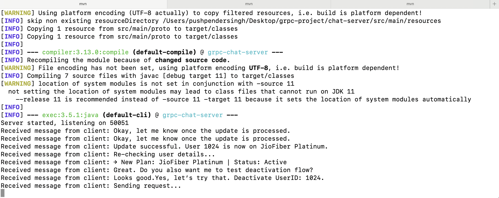
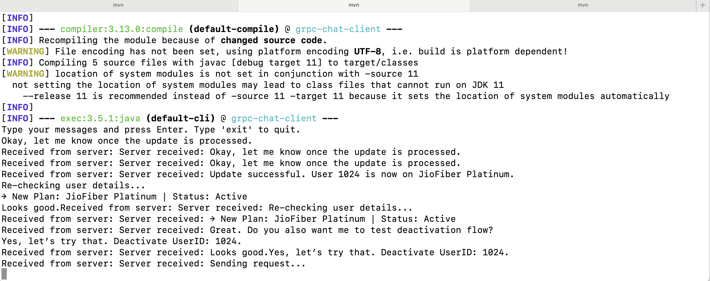
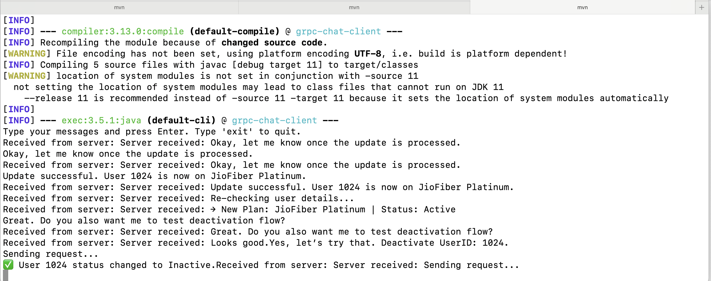

# gRPC Chat Application

A simple real-time chat application demonstrating gRPC bidirectional streaming communication.

## Tech Stack

- **Java 11** - Programming language
- **gRPC** - Remote procedure call framework
- **Protocol Buffers** - Data serialization
- **Maven** - Build tool and dependency management

## Project Structure

```
grpc-project/
├── chat-server/     # gRPC server (port 50051)
├── chat-client/     # First chat client
└── chat-client-2/   # Second chat client
```

## How to Run

### Prerequisites
- Java 11 or higher
- Maven 3.6+

### Running the Application

1. **Start the Server** (Terminal 1):
   ```bash
   cd chat-server && mvn compile exec:java -Dexec.mainClass="com.example.grpc.chat.ChatServer"
   ```

2. **Start Client 1** (Terminal 2):
   ```bash
   cd chat-client && mvn compile exec:java -Dexec.mainClass="com.example.grpc.chat.ChatClient"
   ```

3. **Start Client 2** (Terminal 3):
   ```bash
   cd chat-client-2 && mvn compile exec:java -Dexec.mainClass="com.example.grpc.chat.ChatClient2"
   ```

### Screenshot

1. Server



2. Client 1



3. Client 2



### Usage

- Type messages in either client terminal and press Enter
- Messages are sent to the server via gRPC streaming
- Type `exit` to disconnect a client
- Server runs on `localhost:50051`

## Features

- Real-time bidirectional streaming
- Multiple client support
- Graceful shutdown handling
- Protocol Buffer message serialization